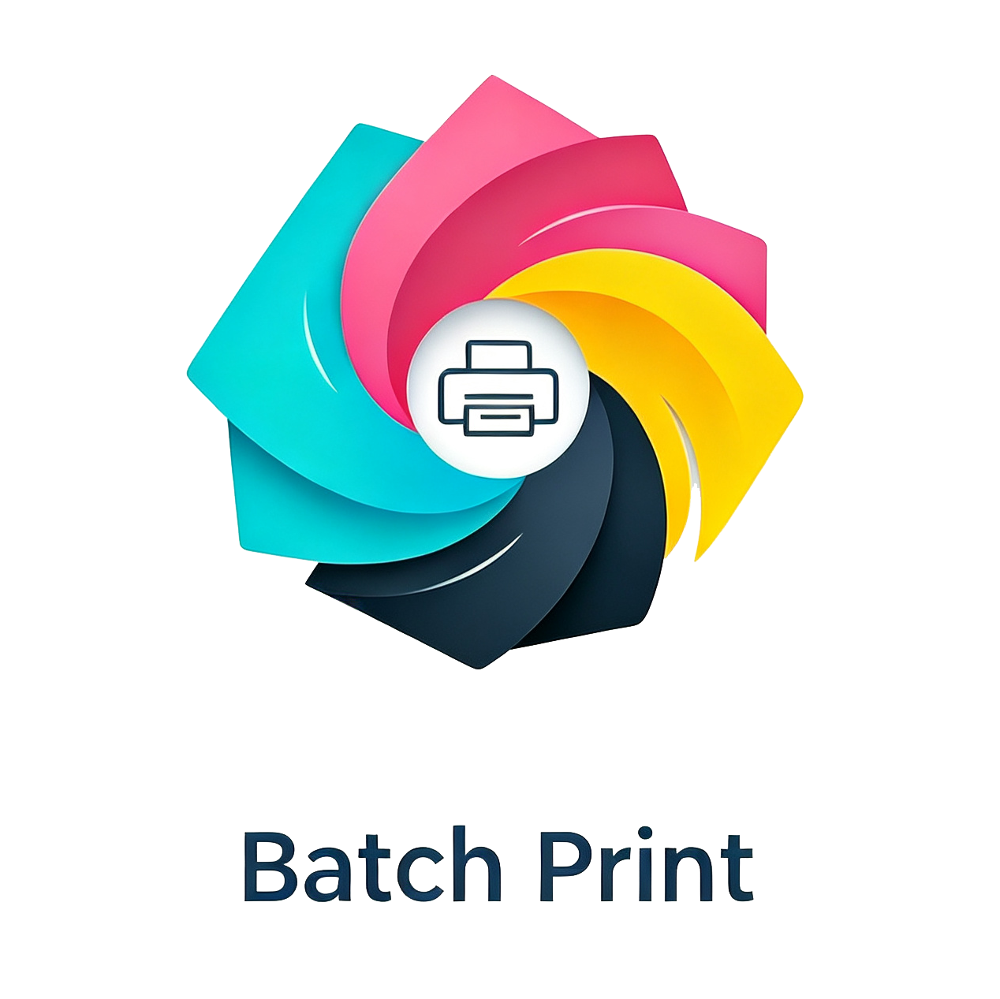
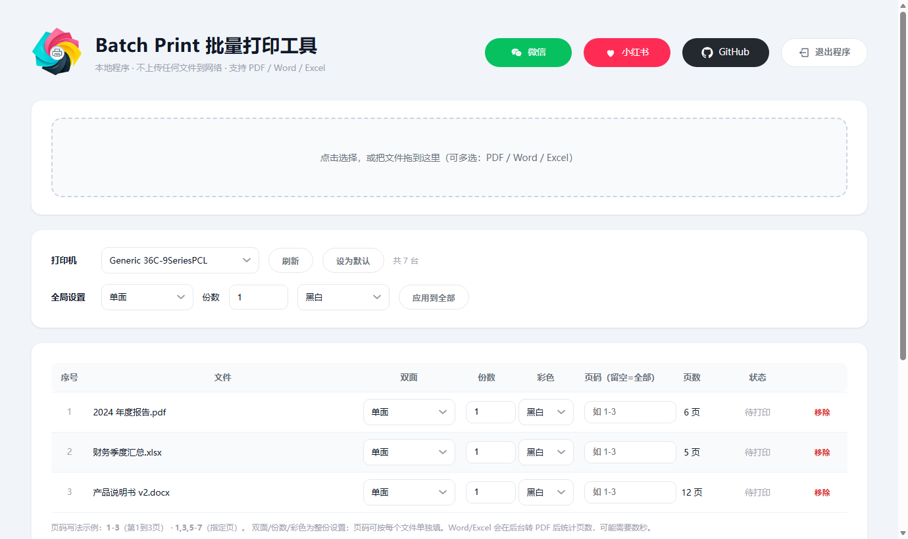

简体中文 | [English](README_en.md)

<div align="center">
  
</div>

<div align="center">


[](https://github.com/tsinghuaking/Batch-Print/releases)
[](https://github.com/tsinghuaking/Batch-Print/releases)

</div>

## 项目简介

**批量打印工具（Batch Print Tool）** 是一款运行在 Windows 上的本地小工具，用来**批量打印 Word / Excel / PDF**，
并支持逐文件设置 **双面 / 单面、打印份数、彩色 / 黑白、打印页码范围**。文件只在本机处理，全程不上传任何网络。

> 为什么需要它：Windows 自带右键「打印」无法逐项设置细节，而这个工具把它们集中到一个网页里，选好一次点「开始打印」即可。

主要特性：

- 📄 **支持 PDF / Word(.doc/.docx) / Excel(.xls/.xlsx)** —— Word、Excel 会先由本机 LibreOffice 转成 PDF 再打印
- 🖨️ **逐文件精细设置**：双面（长边翻转 / 短边翻转）、份数、彩色 / 黑白、页码范围（如 `1-3`、`1,3,5-7`）
- 📋 **表格化任务列表**：自动按文件名排序，序号、文件、双面、份数、彩色、页码、**实时页数**、状态一目了然
- 🎯 **全局 + 单文件双层控制**：顶部「全局设置」选好后点「应用到全部」一次性下发，也可在表格里单独改某一行
- ⚫ **默认黑白**：新上传的文件默认按黑白打印，避免误打彩色浪费墨水
- 💾 **记住默认打印机**：界面点「设为默认」后，下次打开自动选中，无需每次下拉选择
- 🔄 **失败一键重打**：打印失败的文件会标记红色，提供「重新打印失败的文件」按钮单独重试，无需重头再来
- ✅ **实时状态回执**：每个文件发送成功后，对应行状态变绿色「已完成」；失败显示红色「失败」，下方日志有详情
- 🎨 **现代化界面**：参考 Neve 主题设计，苹果字体栈、圆角自定义下拉（不挤占布局、覆盖式展开）、柔和配色，头部带 LOGO 与「Batch Print 批量打印工具」标题
- 🔗 **头部快捷按钮**：右上角提供微信、小红书、GitHub 跳转按钮（平台官方配色，统一大小），便于联系作者与关注项目
- 🪟 **无黑框、普通浏览器打开**：基于 Python 标准库（无第三方 Web 框架），SumatraPDF 打印引擎直接**内嵌进 exe**，**双击即用系统默认浏览器打开网页**（无控制台黑窗）；用完点右上角「退出程序」即可停止后台服务；也可把 `bin/` 放到 exe 同目录改用外置引擎以减小体积
- ⚡ **打印提速**：打印机列表 120 秒缓存、Word/Excel 预转换（点击「开始打印」后状态显示「转换中…」再串行提交），避免边打边等

## 预览

<div align="center">
  
</div>

## 快速开始（普通用户，推荐）

1. 到 [Releases](https://github.com/tsinghuaking/Batch-Print/releases) 下载 **`BatchPrint.exe`**（单文件，自带 SumatraPDF 引擎，约 38MB）。
2. **双击** `BatchPrint.exe`：
   - 自动用系统默认浏览器打开打印页面（无黑框）；
   - 如未自动打开，请手动访问 `http://127.0.0.1:5001`。
3. 用完点页面右上角「退出程序」即可关闭窗口并停止后台服务。

> 如果 `5001` 端口已被占用（之前已开过一个），程序会直接打开浏览器复用已有服务，不会重复启动。

### 想让 exe 更小 / 单独更新打印引擎？

使用「外置版」：把 `bin/` 文件夹（含 `SumatraPDF.exe` 及 `libmupdf.dll`、`PdfFilter.dll`、`PdfPreview.dll`）
与 `BatchPrint.exe` 放在同一目录。此时 exe 会优先使用外置引擎，自身可小到约 10MB。
仓库里的 `bin/` 目录已随源码提供，直接取用即可。

## 使用说明

1. **选打印机**：顶部下拉框选择真实打印机；点「刷新」重新读取；选好常用打印机后点「设为默认」。
2. **上传文件**：点中间虚线框或把文件拖入，可一次多选 PDF / Word / Excel；上传后自动按文件名排序，表格里可看到每个文件的实时页数。
3. **设参数**：
   - 全部一样：在「全局设置」行选好后点「应用到全部」；
   - 单个不同：在表格里每行单独改；
   - 页码写法：`1-3`（第 1~3 页）、`1,3,5-7`（指定页），留空 = 全部页。
4. **开始打印**：点「开始打印」：
   - 若包含 Word/Excel，先在后台批量转 PDF，表格状态显示「转换中…」；
   - 转换完成后逐个提交到打印机，每行状态实时刷新为「已完成 / 失败」；
   - 若有失败，可点旁边的「重新打印失败的文件」单独重试。
5. **查看日志**：页面下方日志区有每次提交的完整命令与返回，失败时显示 SumatraPDF 报错内容便于排查。

## 从源码运行（开发者）

```bash
pip install -r requirements.txt
python app.py
# 浏览器访问 http://127.0.0.1:5001
```

## 打包成 exe

```bash
pip install pyinstaller
python build_exe.py
```

产物在 `dist/批量打印工具.exe`。脚本已用 `--add-data` 把 `bin/`（SumatraPDF 引擎）与 `templates/` 全部打进 exe，
发布时只需这一个文件（自包含、双击即用）。

> 注意：GitHub 网页拖拽上传附件有 25MB 限制；发布时用命令行
> `gh release create vX.Y "dist/批量打印工具.exe"` 上传（走 uploads API，支持到 2GB）。

## 目录结构

```
批量打印工具/
├── app.py              # 网页服务（Python 标准库 http.server，无第三方依赖）
├── print_core.py       # 打印核心：枚举打印机 / Office 转 PDF / 调 SumatraPDF
├── templates/
│   └── index.html      # 网页界面
├── bin/                # 打印引擎 SumatraPDF（随仓库提供，也可外置）
├── requirements.txt
├── build_exe.py        # 打包脚本
├── LICENSE
└── .gitignore
```

## 常见问题

**1. 打印没出纸 / 提示失败？**
- 确认选的是**真实打印机**。「Microsoft Print to PDF / WPS PDF / Adobe PDF」是虚拟打印机，会弹「另存为」窗口，不适合静默批量打印。
- 去 Windows「设置 → 打印机」看该打印机是否处于「已暂停」或「脱机」状态。
- 若之前有失败的打印任务卡在队列里，先清空队列再重试。

**2. 电脑里那台 "WPS PDF" 名字带乱码？**
那是 WPS 安装时写入系统的坏名字（非本工具 bug），且它是虚拟打印机，建议别用来真打。

**3. 为什么要先装 LibreOffice 才能打 Word / Excel？**
Word / Excel 没有系统级命令行打印接口，本工具借 LibreOffice 把它们转成 PDF 再交给 SumatraPDF 打印。
首次转换某个文件可能要等 1~2 分钟（LibreOffice 首次启动慢），之后变快。若只打 PDF 则无需安装。

**4. 上传的文件存在哪？**
临时存放在 `%USERPROFILE%/.batch_print/uploads/`，打印完不会自动删除，可手动清理。

**5. 打印时打印机没反应 / 特别慢？**
- 首次切换打印机时会枚举系统所有打印机（约 1~2 秒），之后会缓存 120 秒；
- Word / Excel 在「开始打印」时会在后台预转换（界面显示「转换中…」），转换完才逐个提交，避免边打边卡；
- 若包含多份大文件，请耐心等待表格状态从「转换中…」变为「打印中」。

## 第三方组件许可

- 打印引擎 **SumatraPDF**（内嵌于发布版 exe，也可外置）采用 GPLv3，源码见
  <https://github.com/sumatrapdfreader/sumatrapdf>
- 本项目仅用 Python 标准库（无 Flask 等第三方 Web 框架），自身以 MIT 许可发布（见 [LICENSE](LICENSE)）

## 许可证

本项目以 [MIT License](LICENSE) 发布。
