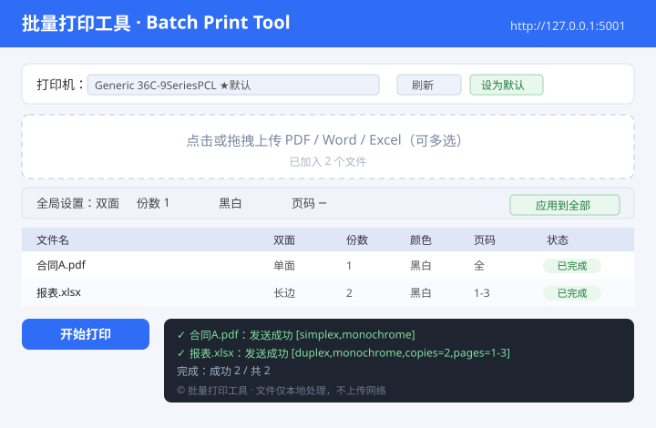

English | [简体中文](README.md)

<div align="center">
  
</div>

<div align="center">


[](https://github.com/tsinghuaking/Batch-Print/releases)
[](https://github.com/tsinghuaking/Batch-Print/releases)

</div>

## Introduction

**Batch Print Tool** is a small local utility for Windows that batch-prints **Word / Excel / PDF** files,
with per-file control over **duplex / simplex, copies, color / monochrome, and page ranges**.
Everything runs on your own machine — no file is ever uploaded to any network.

> Why this exists: Windows' built-in right-click "Print" cannot configure these details per file. This tool puts
> them all in one web page — pick your settings once and hit "Print".

Key features:

- 📄 **PDF / Word(.doc/.docx) / Excel(.xls/.xlsx)** — Word & Excel are first converted to PDF via local LibreOffice
- 🖨️ **Per-file settings**: duplex (long-edge / short-edge flip), copies, color / monochrome, page range (e.g. `1-3`, `1,3,5-7`)
- ⚫ **Monochrome by default**: newly added files print in black & white to avoid wasting color ink
- 💾 **Remember the default printer**: click "Set as default" and it is auto-selected next time — no more dropdown hunting
- ✅ **Print status feedback**: each file turns green "Done" on success, or red "Failed" with details in the log
- 🚀 **Single-file portable exe**: built only on the Python standard library (no third-party web framework); the
  SumatraPDF engine is **embedded in the exe** — just double-click to launch and it opens your browser automatically.
  You can also drop a `bin/` folder next to the exe to use an external engine and shrink the file.

## Preview

<div align="center">
  
</div>

## Quick Start (regular users, recommended)

1. Download **`BatchPrint.exe`** from [Releases](https://github.com/tsinghuaking/Batch-Print/releases)
   (single file, with embedded SumatraPDF engine, ~38MB).
2. **Double-click** `BatchPrint.exe`:
   - A black console window appears (don't close it — closing stops the service);
   - Your default browser opens automatically to `http://127.0.0.1:5001`.
3. Close that console window when you're done.

> If port `5001` is already taken (a previous instance is running), the app simply opens your browser to the
> existing service instead of starting a second one.

### Want a smaller exe / update the engine separately?

Use the "external" layout: put the `bin/` folder (with `SumatraPDF.exe` and `libmupdf.dll`, `PdfFilter.dll`,
`PdfPreview.dll`) next to `BatchPrint.exe`. The exe will prefer the external engine and can shrink to ~10MB.
The `bin/` directory is already included in this repo — just grab it.

## How to use

1. **Pick a printer**: choose a real printer from the top dropdown; click "Refresh" to re-scan; click "Set as default" for your usual one.
2. **Upload files**: click the dashed box or drag files in — multiple PDF / Word / Excel at once.
3. **Set options**:
   - Same for all: choose in the "Global settings" row, then click "Apply to all";
   - Per file: edit each row in the table;
   - Page syntax: `1-3` (pages 1–3), `1,3,5-7` (specific pages), empty = all pages.
4. **Print**: click "Print"; each file shows "Done / Failed" live in the table, with details in the log below.

## Run from source (developers)

```bash
pip install -r requirements.txt
python app.py
# open http://127.0.0.1:5001 in your browser
```

## Build the exe

```bash
pip install pyinstaller
python build_exe.py
```

Output: `dist/批量打印工具.exe`. The script uses `--add-data` to embed `bin/` (SumatraPDF engine) and `templates/`
into the exe, so distribution needs only that one file (self-contained, double-click to run).

> Note: GitHub's web upload caps attachments at 25MB. Publish via the CLI instead:
> `gh release create vX.Y "dist/批量打印工具.exe"` (uses the uploads API, supports up to 2GB).

## Project layout

```
批量打印工具/
├── app.py              # web service (Python stdlib http.server, no third-party deps)
├── print_core.py       # print core: enumerate printers / Office→PDF / call SumatraPDF
├── templates/
│   └── index.html      # web UI
├── bin/                # SumatraPDF engine (shipped in repo, can also be external)
├── requirements.txt
├── build_exe.py        # build script
├── LICENSE
└── .gitignore
```

## FAQ

**1. Nothing prints / it reports failure?**
- Make sure you selected a **real printer**. "Microsoft Print to PDF / WPS PDF / Adobe PDF" are virtual printers that
  pop a "Save As" dialog and don't suit silent batch printing.
- In Windows Settings → Printers, check whether the printer is "Paused" or "Offline".

**2. The "WPS PDF" printer name shows garbage characters?**
That's a bad name WPS wrote into the system at install time (not a bug here), and it's a virtual printer — don't use it for real prints.

**3. Why do I need LibreOffice to print Word / Excel?**
Word / Excel have no system command-line print interface, so the tool uses LibreOffice to convert them to PDF first,
then hands the PDF to SumatraPDF. The first conversion of a file may take 1–2 minutes (slow LibreOffice cold start),
then gets faster. PDF-only users need no LibreOffice.

**4. Where do uploaded files go?**
They are temporarily stored in `%USERPROFILE%/.batch_print/uploads/` and are not auto-deleted after printing — clean up manually if needed.

## Third-party licenses

- Print engine **SumatraPDF** (embedded in the release exe, also external-able) is GPLv3 — source at
  <https://github.com/sumatrapdfreader/sumatrapdf>
- This project uses only the Python standard library (no Flask or other web framework) and is released under MIT (see [LICENSE](LICENSE)).

## License

Released under the [MIT License](LICENSE).
